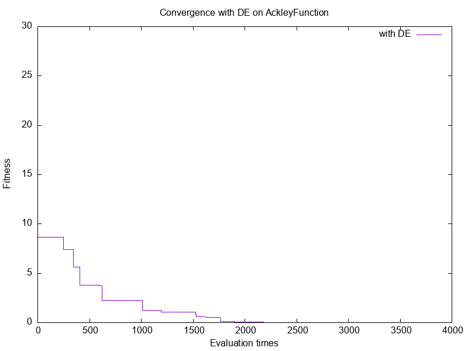

# Implement PSO, DE, and JADE to Solve the Ackley Function

## ( I ) Introduction
- Language: C++
- Metaheuristic algorithms: PSO, DE, and JADE (adaptive DE)
- Benchmark function: Ackley function (dim = 2, 10, 30)
- Visualization: gnuplot
- Supports configurable parameters: dimension, population size, etc.

## ( II ) Main Functionality

### `Particle Swarm Optimization (PSO)`
- `void RunALG(int dim, int pop_size)`  
  *Runs PSO*

- `void Init()`  
  *Initializes `pop_size` solutions of `dim` dimensions and sets up `personal_best` & `global_best`*

- `void Transition()`  
  *Updates velocity and position of particles*

- `void Evaluation()`  
  *Calculates fitness values of new solutions*

- `void Determination()`  
  *Updates `personal_best` and `global_best`*

### `Differential Evolution (DE)`
- `void RunALG(const int& dim, const int& pop_size, const double& CR, const double& F)`  
  *Runs DE*

- `void Init()`  
  *Initializes `dim * pop_size` candidate solutions*

- `void Mutation()`  
  *Applies the "DE/rand/1" mutation strategy to generate donor vectors*

- `void Crossover()`  
  *Performs crossover between original and donor vectors to create trial vectors*

- `void Evaluation()`  
  *Calculates fitness of trial vectors*

- `void Determination()`  
  *Determines whether original or trial vector survives and updates `best_fit`*

### `Adaptive Differential Evolution with External Archive (JADE)`
- `void RunALG(const int& dim, const int& pop_size, const double& CR, const double& F, const double& c, const double& p)`  
  *Runs JADE*

- `void Init()`  
  *Initializes `dim * pop_size` candidate solutions*

- `void Mutation()`  
  *Applies the "DE/current-to-pbest/1" strategy to generate donor vectors*

- `void Crossover()`  
  *Performs crossover between original and donor vectors to create trial vectors*

- `void Evaluation()`  
  *Calculates fitness of trial vectors*

- `void Determination()`  
  *Selects the better individual and updates `best_fit`*

- `void ParaAdaptation()`  
  *Adapts control parameters `mCR` and `mF`*

## ( III ) Input

### Command-line arguments:
- **dim:** Problem dimensionality (2 / 10 / 30)
- **pop_size:** Population size (e.g., 100)
- For DE & JADE only:
  - **CR:** Crossover rate (for DE & JADE, default = 0.9 for DE, 0.5 for JADE)
  - **F:** Donor rate / scaling factor (for DE & JADE, default = 0.5 for DE, 0.5 for JADE)
- For JADE only:  
  - **c:** Adaptation rate (for JADE, range = 0.05 ~ 0.2)
  - **p:** Top p% used to select x_pbest (for JADE, range = 0.05 ~ 0.2)

## ( IV ) Output

### `PSO`
- `fitness_PSO_dim(2 or 10)_pop100.txt`
- `plot_PSO.plt`
- `result_Ackley_PSO_dim(2 or 10)_pop100.png`

### `DE`
- `fitness_DE_dim(2 or 10)_pop100_CR9_F5.txt`  
  *(CR9 = CR 0.9, F5 = F 0.5)*
- `plot_DE.plt`
- `result_Ackley_DE_dim(2 or 10)_pop100_CR9_F5.png`

### `JADE`
- `fitness_JADE_dim(2 or 10)_pop100_c20_p20.txt`  
  *(c20 = c 0.2, p20 = p 0.2)*
- `plot_JADE.plt`
- `result_Ackley_JADE_dim(2 or 10)_pop100_c20_p20.png`

## ( V ) How to Compile and Run

### Compile

#### Visual Studio
1. Open the project `ackleyfunction.sln`
2. Press `Ctrl + F5` to build

#### VSCode
1. Open PowerShell or Windows CMD
2. Navigate to the correct folder
3. Compile with:
```bash
g++ main.cpp DE.cpp JADE.cpp PSO.cpp Ackley.cpp -o ackleyfunction.exe
```

### Run
1. Open PowerShell or Windows CMD
2. Navigate to the correct folder
3. Run the program with:
```bash
.\ackleyfunction.exe 2 100 0.9 0.5
```
You will be prompted:
```
Choose Algorithm ( PSO / DE / JADE )
```
If you select JADE, you will be further prompted:
```
Please enter the value of adaptation rate c =
Please enter the value of the top % pop chosen for pbest =
```

### Plot Results
1. Install gnuplot
2. Open CMD or PowerShell
3. Run with:

```bash
gnuplot plot_PSO.plt
gnuplot plot_DE.plt
gnuplot plot_JADE.plt
```

Output PNGs will appear in the working directory

## ( VI ) File Structure

```
ackleyfunction/
│
├── main.cpp
├── PSO.cpp / PSO.h
├── DE.cpp / DE.h
├── JADE.cpp / JADE.h
├── Ackley.cpp / Ackley.h
│
├── results/            ← output files (.txt, .png)
├── docs/               ← algorithm notes (.md)
└── README.md           ← this file
```

## ( VII ) Experimental Results

### Convergence Comparison (dim = 2, pop = 100)
<p align="center">
  
  
  
</p>

### Convergence Comparison (dim = 30, pop = 100)
<p align="center">
  
  
  
</p>

## ( VIII ) Observations
- JADE converges faster and avoids premature convergence in high-dimensional scenarios
- Adaptive control of parameters (CR, F) significantly enhances JADE's performance
- For more insights, refer to `docs/JADE_Algo_Note.md`

## ( IX ) Key Features
- Object-oriented design in C++
- DE strategy: `DE/rand/1/bin`
- JADE strategy: `DE/current-to-pbest/1`
- Adaptive learning of control parameters (mCR, mF)
- Command-line parameter tuning
- Automated result visualization with gnuplot

## ( X ) Skills Demonstrated
- Modular C++ programming
- Metaheuristic algorithm implementation
- Benchmarking and convergence analysis
- Parameter sensitivity study
- Visualization scripting with gnuplot

## ( XI ) Related Documents
- [JADE_Algo_Note.md](docs/JADE_Algo_Note.md)
