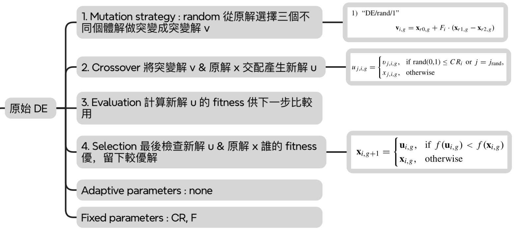
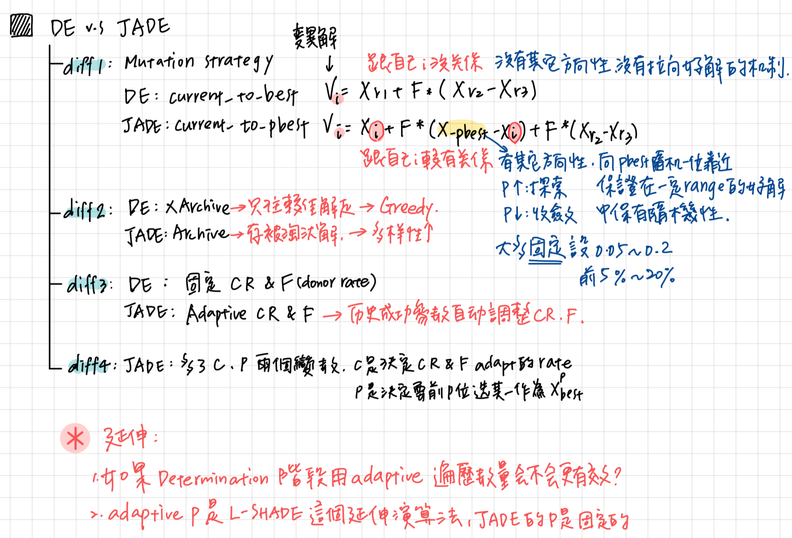
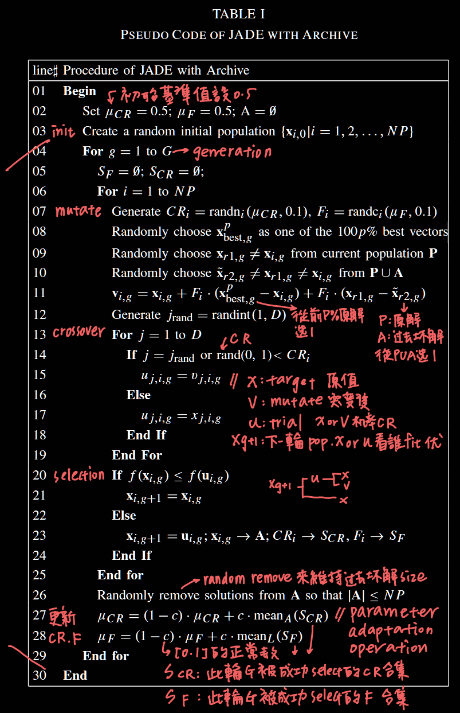

#computerscience 

**論文連結 :** [Zotero](zotero://select/library/items/2FU3TN25)
**專案連結 :  [GitHub](https://github.com/MinQiDu/Voronoi_Diagram_Visualizer.git)  / [本地資料夾](C:\Users\user\Documents\MyCode\VisualStudio\voronoi\voronoi\voronoi.cpp) / [原始碼](C:\Users\user\Documents\MyCode\VisualStudio\voronoi\voronoi\voronoi.cpp) / [README.md](C:\Users\user\Documents\MyCode\VisualStudio\voronoi\README.md) **

## **( 一 ) 定義**

---

## **( 二 ) 結構**

---

## **( 三 ) 觀察 & 問題**

### 1. 為何 CR[i] & F[i] 分別使用高斯分布 & 柯西分布？

|取樣的來源|結果特性|使用於|
|---|---|---|
|高斯分佈|取值結果會接近平均值 -> 較細緻|CR[i]|
|柯西分佈|較大機會得到遠離平均值的值 -> 多樣性高，探索性高|F[i]|

---

### 2. 為何 μCR & μF 分別使用一般算術平均 & 萊納平均 ?

|Mean Function|結果特性|使用於|
|---|---|---|
|一般算術平均 (Arithmetic mean)|平均值容易被較小的值拉低|μCR|
|萊納平均 (Lehmer mean)|比普通平均更偏向**大數值**|μF|

實際更新出來的μF之所以會偏小是因為 : 小μF會有較高的成功率，但要注意小μF進步幅度不大，所以才需要使用Lehmer mean偏重較大值的特性來計算新一代的μF

---

### 3. 觀察到 JADE 比 DE 慢很多

因為 :

1. 動態參數調適（mCR 與 mF）
2. 額外的 A 集合（archive）使用與維護
3. 排序選擇 Xpbest（Top-p%）
4. 更複雜的 mutation strategy "current-to-pbest"

---

### 4. 高維度問題 JADE 優於 DE

---

## **( 四 ) 相關延伸**

- L-SHADE (Learning Strategy Applied to Differential Evolution) : 進一步動態調整 p 及 N P 參數值的延伸演算法
- 將 Adaptive parameter 概念用到 MOO (多目標最佳化) 問題上
- JADE 使用 adaptive updating control parameter 策略的優秀結果證明，要解決複雜的單一問題或多個不同問題，不建議用固定的 control parameter setting 來處理，指的是參數的值若隨著題目風格動態調整會更好，更進一步甚至可以調整當下要使用的 parameter group 要使用那些 relevant 或不使用那些 irrelevant parameters。 延伸出一個研究方向 : **feature selection**

---

## **( 五 ) 參考連結**

[J.-Q. Zhang, A.C. Sanderson, “JADE_ Adaptive Differential Evolution With Optional External Archive,” _IEEE Transactions on Evolutionary Computation_, vol. 13, no. 5, pp. 945-958, 2009.](http://ieeexplore.ieee.org/document/5208221/)