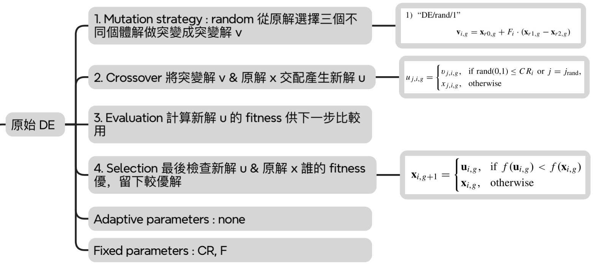
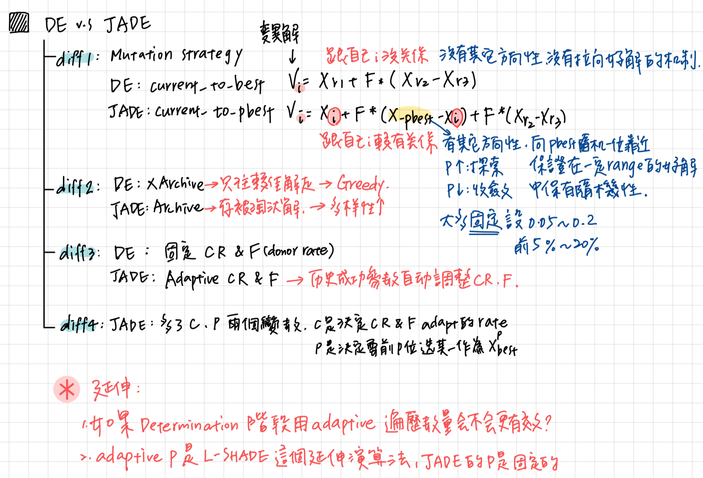
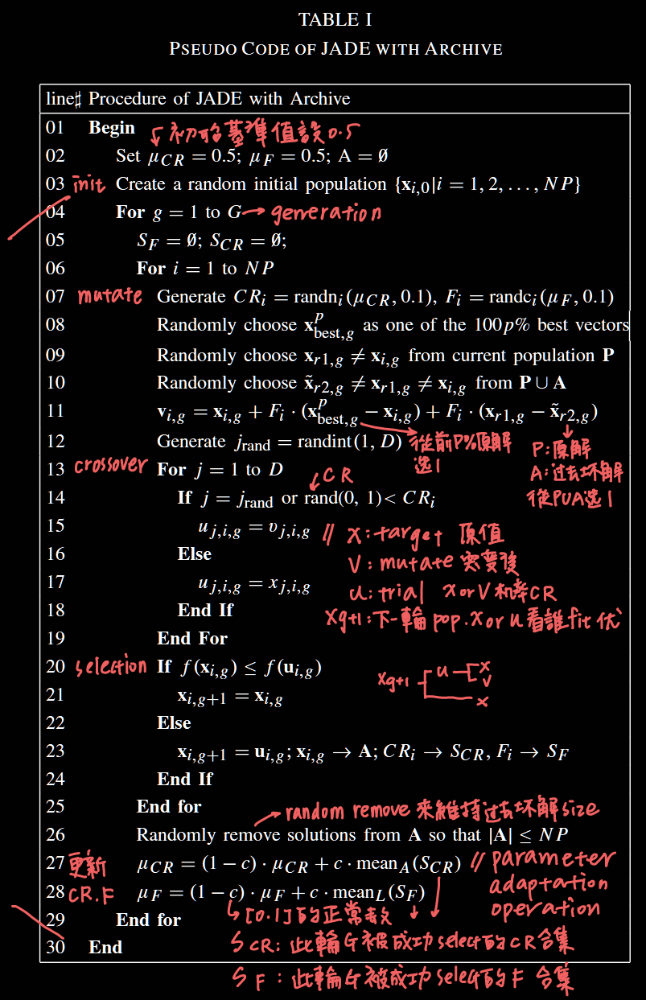
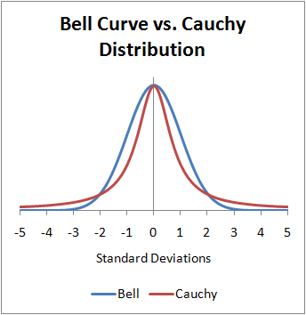

# Computer Science

**Paper Link:** [Zotero](zotero://select/library/items/2FU3TN25)  
**Project Link:** [GitHub](https://github.com/MinQiDu/Voronoi_Diagram_Visualizer.git) / [Local Folder](C:\Users\user\Documents\MyCode\VisualStudio\voronoi\voronoi\voronoi.cpp) / [Source Code](C:\Users\user\Documents\MyCode\VisualStudio\voronoi\voronoi\voronoi.cpp) / [README.md](C:\Users\user\Documents\MyCode\VisualStudio\voronoi\README.md)

---

## ( I ) Definition
  

---

## ( II ) Structure

---

## ( III ) Observations & Questions

### 1. Why are CR[i] & F[i] sampled from Gaussian and Cauchy distributions respectively?

| Source of Sampling | Characteristic of Result | Applied To |
|--------------------|---------------------------|------------|
| Gaussian           | Values tend to be close to the mean → fine tuning | CR[i]      |
| Cauchy             | Values have higher chance to be far from the mean → high diversity, strong exploration | F[i]       |

---

### 2. Why use Arithmetic Mean for μCR and Lehmer Mean for μF?

| Mean Function     | Characteristic of Result                      | Applied To |
|-------------------|-----------------------------------------------|------------|
| Arithmetic Mean   | Mean value is pulled down by smaller values   | μCR        |
| Lehmer Mean       | Biased more toward **larger values**          | μF         |

The reason μF often turns out small in actual updates is because smaller μF values tend to yield higher success rates. However, small μF results in less significant improvements, so Lehmer Mean is used to emphasize larger values in the new generation’s μF.

---

### 3. JADE is significantly slower than DE

Reasons include:

1. Adaptive parameter adjustment (mCR and mF)  
2. Use and maintenance of archive A  
3. Selection of x_pbest via sorting (Top-p%)  
4. More complex mutation strategy: "current-to-pbest"

---

### 4. JADE outperforms DE in high-dimensional problems

---

## ( IV ) Extensions

- **L-SHADE (Learning Strategy Applied to Differential Evolution):** An extension of DE with dynamic adjustment of `p` and `NP` parameters.
- Applying the concept of adaptive parameters to **multi-objective optimization (MOO)** problems.
- The strong results of JADE with adaptive control parameter updating show that solving complex single or multiple problems benefits from dynamic control parameter settings rather than fixed ones.  
  The idea is that parameter values should dynamically adjust depending on the nature of the problem, and even choose which parameter groups are **relevant** or **irrelevant** during optimization.  
  This leads to a new research direction: **feature selection**.

---

## ( V ) References

[J.-Q. Zhang, A.C. Sanderson, “JADE: Adaptive Differential Evolution With Optional External Archive,” _IEEE Transactions on Evolutionary Computation_, vol. 13, no. 5, pp. 945–958, 2009.](http://ieeexplore.ieee.org/document/5208221/)
